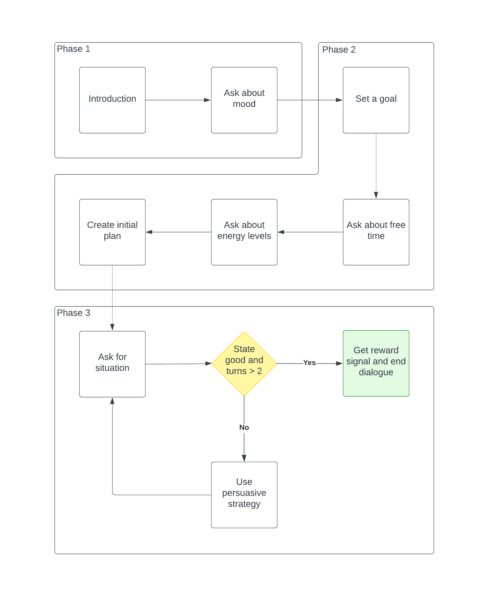
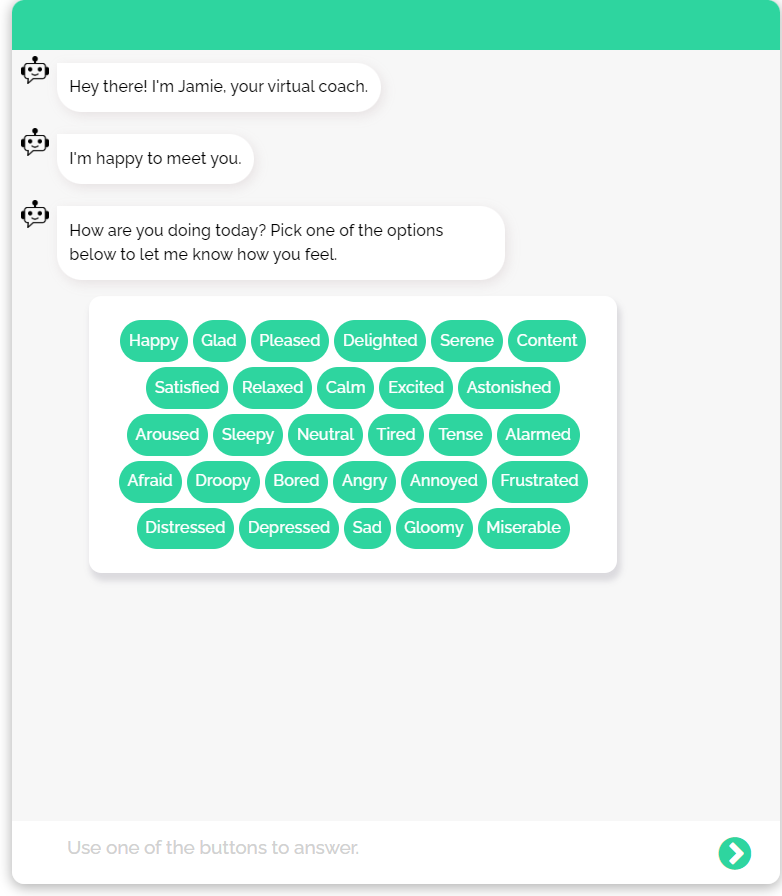

# Dyadic Physical Activity Planning with a Virtual Coach: Using Reinforcement Learning to Select Persuasive Strategies

This github repository contains the code for the virtual coach Jamie, that is created for the thesis project titled "Dyadic Physical Activity Planning with a Virtual Coach: Using Reinforcement Learning to Select Persuasive Strategies." Jamie was used to gather data dring an observational study. Please refer to the [OSF pre-registration](https://doi.org/10.17605/OSF.IO/8ADP9) for more details on the observational study. For the code used to create a reinforcement learning model based on the data gathered, and for the code used for the analysis of this model, please refer to the [published data and code](https://doi.org/10.4121/2796f502-0610-4a7d-a8ee-ebc36639e0b1).

## Dialogue flow

In the observational study, people talked to the virtual code in a single session. During this session, the virtual coach first introduced itself and asked the person how they are feeling. Then, the person could pick a goal for walking, after which they were asked to indicate when they are free and how their energy levels change throughout the day. Using this information, an initial plan for taking walks was created. To gather the data needed for the reinforcement learning model, the virtual coach then asked three questions about the person's situation, composed on confidence in following the plan, perceived usefulness of planning, and attitude towards planning. Next, the virtual coach would use a random persuasive strategy and ask these questions again. This repeated until at least two persuasive strategies were used and until the person's confidence, perceived usefulness and attitude were high enough to assume that they would commit to the plan. Before ending the conversation, the virtual coach asked four more questions to gather the reward signal, composed on the person's satisfaction with the dialogue, their commitment ot the firts two weeks and to the entire plan, and their confidence in reaching the goal.

## System architecture

### Frontend

The frontend is a html-page. Accessing the page via localhost requires to provide a user id and session number in the URL. For example, `localhost/?userid=1` opens the conversation for the user with id 1.

Files:
- static/css/style.css contains the stylesheet for the html-page.
- static/js/script.js contains the functions for the interaction between the user and the chatbot and for the communication between front- and backend.
- index.html contains the code for the frontend html-page.
- server.js contains the code to start the server and initialize the correct session.

### Backend

The backend is a combination of files that split the logic of what the chatbot should say, what internal actions should be taken and which variables to keep during the session.

Files:
- data/rules.yml contains the rules of the chatbot, stating what to do when something is triggered by the user or chatbot itself.
- models contains the trained models for the chatbot to use with all the rules, actions and other information.
- domain.yml contains the actual phrases of the chatbot and the variables that need to be tracked during the conversation.

### Actions

The actions is a file containing all the logic in relation to database access and calculations needed during the conversation which can be used by the backend files.

Files:
- actions.py containing all the logic in relation to database access and calculations needed during the conversation.

### Database (db)

The database is a Mysql database storing all the relevant information from the conversation.
Meanwhile, a Postgres database stores all the session details, for example, every utterance of the chatbot and user.

## Running the virtual coach locally

To run the chatbot locally:
1. Install Docker (in case you have not), which you can do by following the instructions [here](https://docs.docker.com/get-docker/).
2. Install Docker-compose by running:
	- `sudo curl -L "https://github.com/docker/compose/releases/download/1.26.2/docker-compose-$(uname -s)-$(uname -m)" -o /usr/local/bin/docker-compose` 
	- `sudo chmod +x /usr/local/bin/docker-compose`
3. Create a fork and clone this project.
4. Navigate to the root folder of this project (where this README is located).
5. Run `./run.sh` to build the rasa model, build docker and bootup the server for the chatbot.
6. Open `localhost/?userid=<some_user_id>` and replace \<some_user_id\> and \<sessionnumber\> with the user id. 

Note that the virtual coach checks if there is already data for a specific user in the database and will prevent the same user from starting the conversation multiple times. The first time data is saved to the database is after the virtual coach asks the three repeating questions, so if a cetrain user id got to that point, it is saved in the database and when trying to start the conversation again, the virtual coach will not let you start the conversation.

## Setup on Google Compute Engine

To run this project on a Google Compute Engine, I followed these steps:

   - Create a Google Compute Engine instance:
	  - Use Ubuntu 20.04.
	  - Make sure that the location is in Europe.
	  - Enable http and https traffic.
	  - Choose a small instance for the start, since you have to pay more for larger instances. I started with an e2-medium machine type and 100GB for the boot disk.
	  - The first 3 months you have some free credit.
      - Follow the instructions from [here](https://github.com/AmirStudy/Rasa_Deployment) in the sense that you “allow full access to all cloud APIs” on the Google Compute Engine instance. This is shown in this video: https://www.youtube.com/watch?v=qOHszxJsuGs&ab_channel=JiteshGaikwad. Also see this screenshot:
   
      
   
   - Open port 5005 for tcp on the Compute Engine instance:
	
   
	
   
	
   
	
   
   
   
	
   - Follow the instructions from [here](https://github.com/AmirStudy/Rasa_Deployment) for installing Docker on the Google Compute Engine instance. You can do this via the command line that opens after you click on "SSH":
   
   
	
   - Install docker-compose on the instance:
	  - I followed the steps described [here](https://levelup.gitconnected.com/the-easiest-docker-docker-compose-setup-on-compute-engine-ec171c09a29a):
	     - `curl -L "https://github.com/docker/compose/releases/download/1.26.2/docker-compose-$(uname -s)-$(uname -m)" -o /usr/local/bin/docker-compose`
	     - `chmod +x /usr/local/bin/docker-compose`
	     - You might need to add `sudo` in front of the commands to make them work.
   - I suggest getting a static IP address for your Google Compute Engine instance:
      - Follow the instructions here: https://cloud.google.com/compute/docs/ip-addresses/reserve-static-external-ip-address.
	  - You have to pay for every month, but it is rather cheap.
   - Make sure you turn off your instance whenever you do not need it, as you are charged for the time that it is up.
   - Create your own branch/fork from this project.
   - If you are NOT using Nginx, set the IP address of your Google Compute Engine instance in the function `send(message)` in the file frontend/static/js/script.js: `url: "http://<your_instance_IP>:5005/webhooks/rest/webhook"`.
      - When you run the project locally, use `url: "http://localhost:5005/webhooks/rest/webhook"`.
   - Clone your project from Github on the Google Compute Engine instance.
   - Navigate to your project folder on the Compute Engine instance and start your project with `docker-compose up`.
   - Check if all your containers are running on your Google Compute Engine instance via `docker container ls`.
   - You can access the frontend from your browser via `http://<your_instance_IP>/?userid=<some_user_id>&n=1`. `n` determines which session is started (1-5). Earlier sessions need to be completed by a user to be able to access later ones.
      - If you are not using Nginx, you also need to specify the port number: `http://<your_instance_IP>:3000/?userid=<some_user_id>&n=1`.
	  - And if you are not using Nginx, you also need to open port 3000 on your Google Compute Engine instance for tcp.
   - Open the chat here:
   
      
   
      - The button can be very small on your phone.
   
   - The chat should look something like this:
   
   
   
   
This project uses an SQLTrackerStore (https://rasa.com/docs/rasa/tracker-stores/) to store the conversation history in a database:
   - A nice way to see the contents of this database is using the program DBeaver.
      - First also open port 5432 on your Google Compute Engine instance for tcp. There is no need to restart the instance after opening the port.
      - To configure DBeaver, add a new database connection:
   
      
   
      - Select a "PostgresSQL" connection.
      - Enter your instance's IP address as the "Host", keep the "Port" set to 5432, enter the username and password used in docker-compose.yml, and set the "Database" to "rasa".
      - After connecting, you can inspect the database content by clicking on the "events" table:
   
      
   
      - After clicking on "Data," you can see the table content. The "sender_id" is the "<some_user_id>" you used when accessing your frontend:
   
      
   
      - To refresh the view, you can click on File > Refresh in DBeaver.
	  - You can also export the data in the database:
	  
	  

   - The database is persistent because of the "volumes" we specified in docker-compose.yml for postgres. Read more about this here: https://medium.com/codex/how-to-persist-and-backup-data-of-a-postgresql-docker-container-9fe269ff4334.
      - So you can run `docker-compose down --volumes` and `docker-compose up --build` and the database content is still there. Check for yourself using DBeaver.
	  - To delete the database content, just remove the "data"-folder.

The project further uses an mysql database to store specific data from the conversations:
   - The database is also persistent. The folder "data_mysql" is used for this, as set up in docker-compose.yml.
   - To inspect the database content content with DBeaver, first open port 3306 on your instance for tcp. Again, there is no need to restart your instance after opening this port.
   - When setting up the connection, use "db" for "Database", "root" for "Username", and the password specified in docker-compose.yml. Keep "Port" to 3306. The "Server Host" is the IP address of your instance.
      - You might have to set "allowPublicKeyRetrieval" to "true" in "Driver properties." 
   - To delete the database content, just delete the folder "data_mysql" on your Google Compute Engine instance.
   - Make sure to use a secure password. This needs to be set in both docker-compose.yml and actions/definitions.py. For example, see [this post](https://www.akamai.com/blog/security/btc-strikes-back-now-attacking-mysql-databases).

Some errors I got during the setup:
   - "Couldn't connect to Docker daemon at http+docker://localhost - is it running? If it's at a non-standard location, specify the URL with the DOCKER_HOST environment variable“ when running `docker-compose up –-build`.
      - I followed the steps suggested here: https://forums.docker.com/t/couldnt-connect-to-docker-daemon-at-http-docker-localhost-is-it-running/87257/2.
	  - These 2 steps fixed the issue for me:
	     
		 
		 
		 - Run `sudo docker-compose up –-build`. 
		 
   - When running the project locally on Windows:
      - I got an error for the SQLTrackerStore when running `docker-compose up –-build`. Just removing the information on `volumes` in docker-compose.yml helped. This removes the persistence though.
	  - Since adding nginx, nginx does not work out of the box. To just quickly get the project to work locally, I ignored the nginx part. So I accessed the frontend via "localhost:3000/?..." and changed the url in the file script.js to `url: "http://localhost:5005/webhooks/rest/webhook",`.

## License

Copyright (C) 2023 Delft University of Technology.

Licensed under the Apache License, version 2.0. See LICENSE for details.
